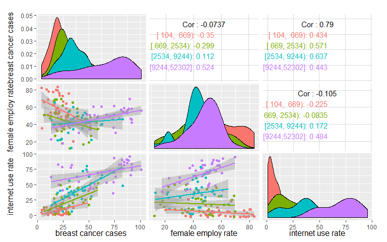

# Data Analysis (Moderation) - R
Sarah Pohl  


And now, the final [DataAnaT](http://lilithelina.tumblr.com/tagged/DataAnaT) analysis in the R version, since, as [mentioned before](http://lilithelina.tumblr.com/post/128638794919/choice-of-language), I want to compare Python and R analysis steps in the [DataManViz](http://lilithelina.tumblr.com/tagged/DataManViz) and now [DataAnaT](http://lilithelina.tumblr.com/tagged/DataAnaT) projects.
Therefore, this is the R version of the [Data Analysis - Moderators](http://lilithelina.tumblr.com/post/143790528809/data-analysis-moderators-python) Python script. Again, the whole thing will look better over [here](http://htmlpreview.github.io/?https://github.com/LilithElina/Data-Analysis-and-Interpretation/blob/master/DataAnaT/Week_Four_Moderator.html).

I will first run some of my previous code to remove variables I don't need (keeping one more, income per person, as a moderator) and observations for which important data is missing.


```r
# load libraries
library(GGally)  # for the pair plot
library(Hmisc)  # for cor.test() -> p-values
library(plyr)  # to easily apply cor.test() to split data

# load data
gapminder <- read.table("../gapminder.csv", sep = ",", header = TRUE, quote = "\"")

# subset data
sub_data <- subset(gapminder, select = c("country", "breastcancerper100th", 
    "femaleemployrate", "internetuserate", "incomeperperson"))

# remove rows with NAs
sub_data2 <- na.omit(sub_data)
```

The moderator variable has to be categorical, so I'll first split it into quartiles.


```r
# split income per person into four groups
sub_data2$incomeQuart <- cut2(sub_data2$incomeperperson, g = 4)
```

This gives me a nice chance to create a pair plot like I did in the [visualisation project](http://lilithelina.tumblr.com/post/132342885914/data-visualisation-r) again, this time including a colouring by income quartiles.


```r
# create pair plot
ggpairs(data = sub_data2, columns = 2:4, upper = list(continuous = "cor", combo = "blank"), 
    lower = list(continuous = "smooth", combo = "dot"), diag = list(continuous = "densityDiag", 
        discrete = "blankDiag"), columnLabels = c("breast cancer cases", "female employ rate", 
        "internet use rate"), mapping = aes(color = incomeQuart))
```

<!-- -->

This plot already provides us with a lot of information. On the diagonal, we can see a relatively clear relationship between income per person (from 2010) and breast cancer cases (2002) and internet usage (2010), respectively. Both of my quantitative variables show lower values in countries with lower income, demonstrating that in higher income countries, more people can afford to use the internet on a regular basis, and more women are diagnosed with breast cancer (probably because they get regular breast cancer check-ups?). This is different for female employment (2007), though. This seems to be especially high in low income countries, and only medium high for high income countries.

We can also see the scatterplots with regression lines, and, similar to what we've seen in the [Python version](http://lilithelina.tumblr.com/post/143790528809/data-analysis-moderators-python), the relationship between breast cancer cases and female employment is strongly influenced by income as a moderator. In lower income countries (first two quartiles, red and green), there is a weak negative correlation, while it is weakly positive in higher income countries (blue and purple). Nothing similar can be observed for breast cancer versus internet usage - this relationship is always positive.

The plot also already displays the correlation coefficients we would otherwise have to calculate now: they show an overall medium high positive correlation between breast cancer and internet usage ($r=0.79$) and lower positive correlation when splitting the data by income. For breast cancer and female employment, though, there is almost no overall correlation ($r=-0.074$), but stronger positive or negative correlation when looking at income quartiles separately.

In order to get *p*-values as well, we have to use the function `cor.test()` from the `Hmisc` package on data from the income quartiles.


```r
# calculate correlation coefficient for breast cancer vs. internet usage by
# income group
breint.r <- ddply(sub_data2, "incomeQuart", function(x) cor.test(x$internetuserate, 
    x$breastcancerper100th)$estimate)
# calculate associated p-value
breint.p <- ddply(sub_data2, "incomeQuart", function(x) cor.test(x$internetuserate, 
    x$breastcancerper100th)$p.value)
# combine data, remove duplicate income group column and rename other
# columns
breint <- cbind(breint.r, breint.p)
breint[, 3] <- NULL
colnames(breint) <- c("income", "r", "p")

# calculate correlation coefficient for breast cancer vs. female employment
# by income
brefem.r <- ddply(sub_data2, "incomeQuart", function(x) cor.test(x$femaleemployrate, 
    x$breastcancerper100th)$estimate)
# calculate associated p-value
brefem.p <- ddply(sub_data2, "incomeQuart", function(x) cor.test(x$femaleemployrate, 
    x$breastcancerper100th)$p.value)
# combine data, remove duplicate income group column and rename other
# columns
brefem <- cbind(brefem.r, brefem.p)
brefem[, 3] <- NULL
colnames(brefem) <- c("income", "r", "p")

# print results
cat("association between internet usage and breast cancer cases\n")
breint
cat("\nassociation between female employment and breast cancer cases\n")
brefem
```

```
association between internet usage and breast cancer cases
        income         r            p
1 [ 104,  669) 0.4343352 5.104691e-03
2 [ 669, 2534) 0.5705095 1.212211e-04
3 [2534, 9244) 0.6367126 1.001726e-05
4 [9244,52302] 0.4430113 4.199100e-03

association between female employment and breast cancer cases
        income          r            p
1 [ 104,  669) -0.3503670 0.0266618999
2 [ 669, 2534) -0.2993460 0.0605892507
3 [2534, 9244)  0.1123141 0.4901941282
4 [9244,52302]  0.5236287 0.0005255656
```

The results above again list the correlation coefficients per income groups, which are also displayed in the figure above, this time accompanied by $p$-values. We can see that the variably strong positive correlation between breast cancer and internet usage are always significant at $p<0.05$. For breast cancer and female employment, though, only the first correlation coefficient (lowest income group), which is rather weak and negative, is significant at $p<0.05$, as well as the last one, which shows a moderately strong positive correlation for breast cancer and female employment in high income countries. This implies that, in low income countries (measured in 2010), a higher number of breast cancer cases diagnosed in 2002 lead to a lower female employment rate in 2007, while the opposite happened in high income countries. This result is still open for interpretation while I'm moving on to the next course in the [Data Analysis and Interpretation specialisation](https://www.coursera.org/specializations/data-analysis). ;-)
