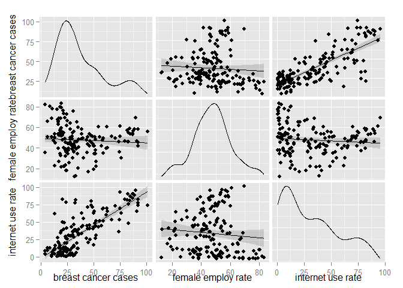
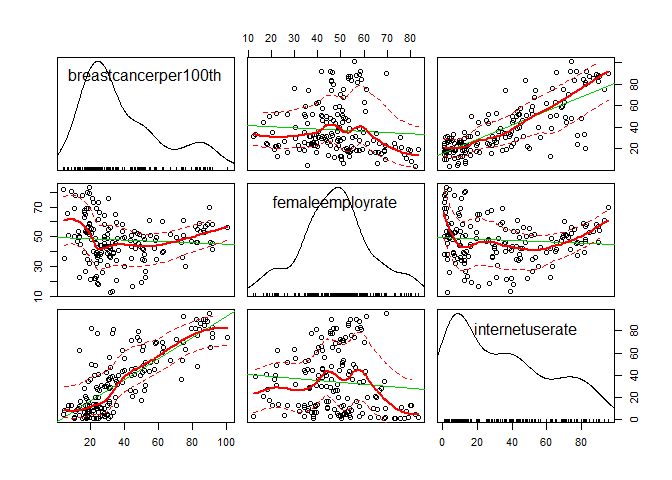
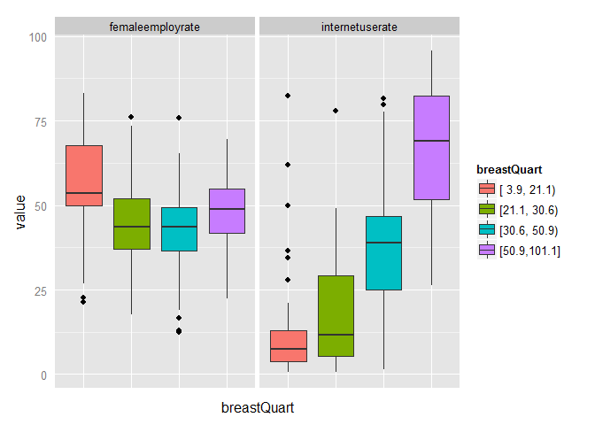

# Data Analysis (ANOVA) - R
Sarah Pohl  
Friday, November 11, 2015  


Welcome again to the first week of the second [Data Analysis and Interpretation course](https://www.coursera.org/specializations/data-analysis) - this time in R!  
Since this is the beginning of a new "chapter" ([Data Analysis Tools](https://www.coursera.org/learn/data-analysis-tools/)), here's a short summary of the data I'm working with: it's a subset of the [Gapminder](http://www.gapminder.org/) data, containing mostly numerical, continuous variables describing different topics in a number of countries. I'm subsetting this data set even further to work with three variables: new breast cancer cases per 100,000 females in 2002, female employment rates in 2007, and internet use rates in 2010. My goal is to analyse a possible relationship between breast cancer and female employment or internet usage, respectively ([Breast Cancer Causes Internet Usage](http://lilithelina.tumblr.com/post/128347327089/choice-of-data) - BCCIU - was my first chosen topic).

As [mentioned before](http://lilithelina.tumblr.com/post/128638794919/choice-of-language), I want to compare Python and R analysis steps in the [DataManViz](http://lilithelina.tumblr.com/tagged/DataManViz) and now [DataAnaT](http://lilithelina.tumblr.com/tagged/DataAnaT) projects, so this is the R version of the [Data Analysis - ANOVA](http://lilithelina.tumblr.com/post/132593030304/data-analysis-anova-python) Python script. Again, the whole thing will look better over [here](http://htmlpreview.github.io/?https://github.com/LilithElina/Data-Analysis-and-Interpretation/blob/master/DataAnaT/Week_One_ANOVA.html).

I will first run some of my previous code: removing variables I don't need and observations for which important data is missing, and plotting an overview plot from the [last post](http://lilithelina.tumblr.com/post/132342885914/data-visualisation-r).


```r
# load libraries
library(GGally)  # for ggpair()
library(car)  # for scatterplotMatrix()
library(Hmisc)  # for cut2()
library(reshape)  # for melt()

# load data
gapminder <- read.table("../gapminder.csv", sep = ",", header = TRUE, quote = "\"")

# subset data
sub_data <- subset(gapminder, select = c("country", "breastcancerper100th", 
    "femaleemployrate", "internetuserate"))

# remove rows with NAs
sub_data2 <- na.omit(sub_data)

# create a pair plot to get some visuals on the data
ggpairs(data = sub_data2, columns = 2:4, upper = list(continuous = "smooth", 
    combo = "blank"), lower = list(continuous = "smooth", combo = "dot"), columnLabels = c("breast cancer cases", 
    "female employ rate", "internet use rate"))
```

 

I'm still not very happy with this plot, but I have difficulties improving it. Luckily, my better half sent me [this nice post](http://www.r-bloggers.com/scatterplots/) on [R-bloggers](http://www.r-bloggers.com/), so I decided to try out the `scatterplotMatrix()` function as well:


```r
scatterplotMatrix(~breastcancerper100th + femaleemployrate + internetuserate, 
    data = sub_data2)
```

 

I like this plot a little better than the `ggpairs()` one, but Python still [wins here](http://lilithelina.tumblr.com/post/131697215314/more-data-visualisation-python).

All of that doesn't matter now, though, because this post's topic is ANOVA - analysis of variance. ANOVA compares in between and within group variances to assess how likely it is that the group means are significantly different. In order to be able to use ANOVA with my data, I have to group my explanatory variable (the new breast cancer cases per 100,000 females in 2002).


```r
# split breast cancer cases into four groups
sub_data2$breastQuart <- cut2(sub_data2$breastcancerper100th, g = 4)

# melt data into long format
sub_data2.m <- melt(sub_data2, id.vars = "breastQuart", measure.vars = c("femaleemployrate", 
    "internetuserate"))
cat("breast cancer cases per 100,000 females - quartiles")
table(sub_data2$breastQuart)

# plot boxplots of variables for the four groups/quartiles
ggplot(sub_data2.m, aes(x = breastQuart, y = value)) + geom_boxplot(aes(fill = breastQuart)) + 
    facet_wrap(~variable) + theme(axis.ticks = element_blank(), axis.text.x = element_blank())
```

 

```
breast cancer cases per 100,000 females - quartiles
[ 3.9, 21.1) [21.1, 30.6) [30.6, 50.9) [50.9,101.1] 
          41           40           41           40 
```

Side note: I switched from using `print()` to using `cat()`, because the output is much better then. `print()` is the function I'd use in Python, I guess it must have gotten dragged over to R.

ANOVA will compare the group means with regards to the variance, so let's have a look at these means and their standard deviations. In my day-to-day life, I often forget this, but `aggregate()` is a wonderfully useful function to calculate means and other data for groups in a `data.frame`:


```r
# calculate means for the breast cancer quartiles
cat("means for female employment and internet usage by breast cancer quartiles\n")
aggregate(sub_data2[, 3:4], list(breastQuart = sub_data2$breastQuart), mean)

# calculate respective standard deviations
cat("\n\nstandard deviations for female employment and internet usage by breast cancer quartiles\n")
aggregate(sub_data2[, 3:4], list(breastQuart = sub_data2$breastQuart), sd)
```

```
means for female employment and internet usage by breast cancer quartiles
   breastQuart femaleemployrate internetuserate
1 [ 3.9, 21.1)         56.14878        13.58304
2 [21.1, 30.6)         44.40750        17.85143
3 [30.6, 50.9)         42.43415        39.06184
4 [50.9,101.1]         47.85500        66.21964


standard deviations for female employment and internet usage by breast cancer quartiles
   breastQuart femaleemployrate internetuserate
1 [ 3.9, 21.1)         16.15684        17.23790
2 [21.1, 30.6)         15.21786        16.59091
3 [30.6, 50.9)         13.23381        21.47907
4 [50.9,101.1]         10.10735        18.55547
```

Even though the four breast cancer groups are not exactly the same as in Python, the results are very similar. While for female employment only the lowest breast cancer group sticks out, the internet use rate goes straight up across the groups, while keeping relatively stable standard deviations.  
The [Python script](http://lilithelina.tumblr.com/post/132593030304/data-analysis-anova-python) accordingly revealed that there are significant differences between the breast cancer groups for both female employment and internet usage. This should be the same with R's `aov()` function.


```r
# calculate F statistic and p-value
breast_inet <- aov(internetuserate ~ breastQuart, sub_data2)
cat("breast cancer versus internet usage\n")
summary(breast_inet)

breast_empl <- aov(femaleemployrate ~ breastQuart, sub_data2)
cat("\n\nbreast cancer versus female employment\n")
summary(breast_empl)
```

```
breast cancer versus internet usage
             Df Sum Sq Mean Sq F value Pr(>F)    
breastQuart   3  70096   23365   67.73 <2e-16 ***
Residuals   158  54503     345                   
---
Signif. codes:  0 '***' 0.001 '**' 0.01 '*' 0.05 '.' 0.1 ' ' 1


breast cancer versus female employment
             Df Sum Sq Mean Sq F value   Pr(>F)    
breastQuart   3   4498  1499.3   7.776 7.08e-05 ***
Residuals   158  30463   192.8                     
---
Signif. codes:  0 '***' 0.001 '**' 0.01 '*' 0.05 '.' 0.1 ' ' 1
```

The output from R's dedicated ANOVA function `aov()` is a lot less cluttered than Python's `ols()` function, which provides all the information of an ordinary least squares linear regression. Here, we can see at a glance that, as expected, there are significant differences in both data subsets. Now we need Tukey's HSD to find out which group means are significantly different. In R, the `TukeyHSD()` function uses the ANOVA results directly to do the multiple comparisons of the group means.


```r
# post hoc test: Tukey's HSD
cat("breast cancer versus internet usage\n")
TukeyHSD(breast_inet)

cat("\n\nbreast cancer versus female employment\n")
TukeyHSD(breast_empl)
```

```
breast cancer versus internet usage
  Tukey multiple comparisons of means
    95% family-wise confidence level

Fit: aov(formula = internetuserate ~ breastQuart, data = sub_data2)

$breastQuart
                               diff       lwr      upr     p adj
[21.1, 30.6)-[ 3.9, 21.1)  4.268389 -6.449361 14.98614 0.7297072
[30.6, 50.9)-[ 3.9, 21.1) 25.478800 14.827414 36.13019 0.0000000
[50.9,101.1]-[ 3.9, 21.1) 52.636600 41.918850 63.35435 0.0000000
[30.6, 50.9)-[21.1, 30.6) 21.210411 10.492660 31.92816 0.0000048
[50.9,101.1]-[21.1, 30.6) 48.368211 37.584505 59.15192 0.0000000
[50.9,101.1]-[30.6, 50.9) 27.157801 16.440050 37.87555 0.0000000


breast cancer versus female employment
  Tukey multiple comparisons of means
    95% family-wise confidence level

Fit: aov(formula = femaleemployrate ~ breastQuart, data = sub_data2)

$breastQuart
                                diff        lwr        upr     p adj
[21.1, 30.6)-[ 3.9, 21.1) -11.741280 -19.754014 -3.7285469 0.0011506
[30.6, 50.9)-[ 3.9, 21.1) -13.714634 -21.677753 -5.7515157 0.0000863
[50.9,101.1]-[ 3.9, 21.1)  -8.293780 -16.306514 -0.2810468 0.0394162
[30.6, 50.9)-[21.1, 30.6)  -1.973354  -9.986087  6.0393796 0.9190553
[50.9,101.1]-[21.1, 30.6)   3.447500  -4.614543 11.5095431 0.6837060
[50.9,101.1]-[30.6, 50.9)   5.420854  -2.591880 13.4335874 0.2982409
```

The main difference in the output here is that we now get an adjusted *p*-value (as before, the family-wise error rate was controlled) instead of a simple "reject" statement in Python.  
As before, all internet use rates except the first two show significantly different means, while only the first female employment mean differs significantly from all others (when grouping the observations by breast cancer cases).

The difference between the R and the Python analysis is that in this script, the breast cancer cases were grouped into groups of 41, 40, 41, 40 observations, while in Python there were 41, 40, 40, 41 observations per group. The results are the same, only the numbers are not exactly identical.  
We found that there is a significant difference in internet usage when grouped by breast cancer cases ($F(3, 158) = 67.73$, $p < 0.0001$), and the *post hoc* Tukey's test revealed that all but the first two breast cancer groups have significantly different means.  
There is also a significant difference in female employment grouped by the same breast cancer cases ($F(3, 158) = 7.776$, $p < 0.0001$), but only countries in the first - lowest - breast cancer group have significantly higher female employment rates ($56.15\% \pm 16.16$) than all the others (between $42\%$ and $48\%$).
