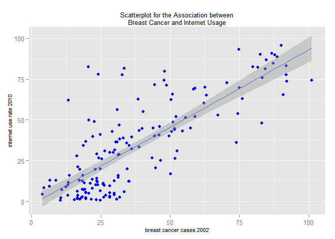
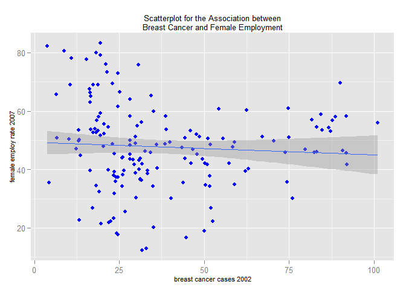

# Data Analysis (Chi-Squared) - R
Sarah Pohl  
20. December 2015  


As [mentioned before](http://lilithelina.tumblr.com/post/128638794919/choice-of-language), I want to compare Python and R analysis steps in the [DataManViz](http://lilithelina.tumblr.com/tagged/DataManViz) and now [DataAnaT](http://lilithelina.tumblr.com/tagged/DataAnaT) projects, so this is the R version of the [Data Analysis - Pearson Correlation](http://lilithelina.tumblr.com/post/135265946959/data-analysis-pearson-correlation-python) Python script. Again, the whole thing will look better over [here](http://htmlpreview.github.io/?https://github.com/LilithElina/Data-Analysis-and-Interpretation/blob/master/DataAnaT/Week_Three_Pearson.html).

I will first run some of my previous code to remove variables I don't need and observations for which important data is missing.


```r
# load libraries
library(reshape)  # for melt()
library(ggplot2)  # for the plot
library(Hmisc)

# load data
gapminder <- read.table("../gapminder.csv", sep = ",", header = TRUE, quote = "\"")

# subset data
sub_data <- subset(gapminder, select = c("country", "breastcancerper100th", 
    "femaleemployrate", "internetuserate"))

# remove rows with NAs
sub_data2 <- na.omit(sub_data)
```

The Pearson correlation coefficient ($r$) is calculated for quantitative variables, so I don't have to group my data this time. Instead, I'll pick up the scatterplots I created for the [Data Visualisation](http://lilithelina.tumblr.com/post/132342885914/data-visualisation-r) task to show you once more how the data I want to analyse the correlation of looks.


```r
# scatterplot for breast cancer versus internet usage
ggplot(sub_data2, aes(x = breastcancerper100th, y = internetuserate)) + geom_point(colour = "blue") + 
    geom_smooth(method = lm) + xlab("breast cancer cases 2002") + ylab("internet use rate 2010") + 
    ggtitle("Scatterplot for the Association between\nBreast Cancer and Internet Usage") + 
    theme(plot.title = element_text(size = 10), axis.title.x = element_text(size = 8), 
        axis.title.y = element_text(size = 8))
```

 

```r
# scatterplot for breast cancer versus female employment
ggplot(sub_data2, aes(x = breastcancerper100th, y = femaleemployrate)) + geom_point(colour = "blue") + 
    geom_smooth(method = lm) + xlab("breast cancer cases 2002") + ylab("female employ rate 2007") + 
    ggtitle("Scatterplot for the Association between\nBreast Cancer and Female Employment") + 
    theme(plot.title = element_text(size = 10), axis.title.x = element_text(size = 8), 
        axis.title.y = element_text(size = 8))
```

 

Once more, we can see a positive and mostly linear relationship between the breast cancer cases of 2002 and the internet usage rates of 2010, while the scatterplot for breast cancer and 2010's female employment rates looks more like a curve than a line.

In R, the easiest way to calculate correlation is using the `base` function`cor()`, but this will not - like Python - return a *p*-value. To get this as well, we need the function `cor.test()` from the `Hmisc` package.


```r
cat("correlation coefficients\n")
cor(sub_data2[, 2:4])

cat("\nassociation between internet usage and breast cancer cases")
cor.test(sub_data2$internetuserate, sub_data2$breastcancerper100th)
cat("\nassociation between female employment and breast cancer cases")
cor.test(sub_data2$femaleemployrate, sub_data2$breastcancerper100th)
```

```
correlation coefficients
                     breastcancerper100th femaleemployrate internetuserate
breastcancerper100th           1.00000000      -0.06792133      0.78974049
femaleemployrate              -0.06792133       1.00000000     -0.09377978
internetuserate                0.78974049      -0.09377978      1.00000000

association between internet usage and breast cancer cases
	Pearson's product-moment correlation

data:  sub_data2$internetuserate and sub_data2$breastcancerper100th
t = 16.2844, df = 160, p-value < 2.2e-16
alternative hypothesis: true correlation is not equal to 0
95 percent confidence interval:
 0.7236694 0.8414668
sample estimates:
      cor 
0.7897405 


association between female employment and breast cancer cases
	Pearson's product-moment correlation

data:  sub_data2$femaleemployrate and sub_data2$breastcancerper100th
t = -0.8611, df = 160, p-value = 0.3905
alternative hypothesis: true correlation is not equal to 0
95 percent confidence interval:
 -0.21981463  0.08718726
sample estimates:
        cor 
-0.06792133 
```

The data above show us all necessary information, including $r$, $p$, and 95% confidence intervals. The first table - the output of `cor()` - is a nice overview of all possible correlation coefficients that can be created from the given data. Here, we can see the positive correlation between breast cancer and internet usage, and negligible negative correlations between female employment and the other two variables.  
The positive linear relationship between breast cancer and internet usage was confirmed with $r=0.79$ (similar to the Python results), with a confidence interval of $0.72 < r < 0.84$ and $p < 0.001$. The association between breast cancer and female employment, which was shown with [ANOVA](http://lilithelina.tumblr.com/post/132994745429/data-analysis-anova-r) and the [Chi-squared](http://lilithelina.tumblr.com/post/134387869079/data-analysis-chi-square-r) test, could not be detected here; the correlation coefficient was too low and the *p*-value too high ($r=-0.07$, $p=0.39$). Additionally, the 95% confidence interval encompasses $0$, the value of no correlation. Again, this is most likely caused by a non-linear relationship, at which the scatterplot and the previous results (only countries with low breast cancer prevalence were significantly different from the others) both hint.
