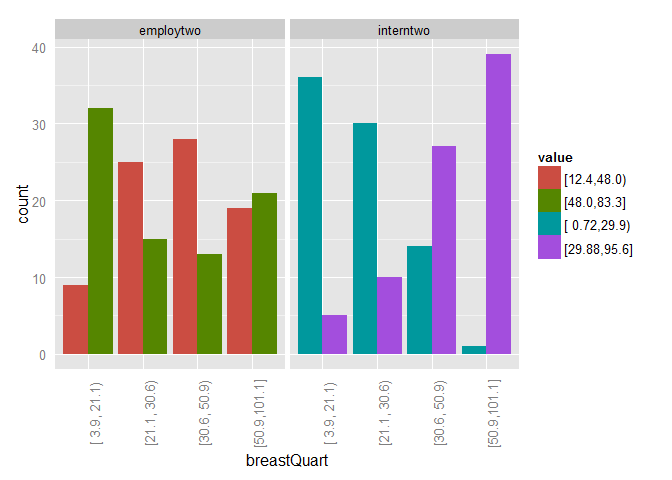

# Data Analysis (Chi-Squared) - R
Sarah Pohl  
30. November 2015  


As [mentioned before](http://lilithelina.tumblr.com/post/128638794919/choice-of-language), I want to compare Python and R analysis steps in the [DataManViz](http://lilithelina.tumblr.com/tagged/DataManViz) and now [DataAnaT](http://lilithelina.tumblr.com/tagged/DataAnaT) projects, so this is the R version of the [Data Analysis - Chi-Square](http://lilithelina.tumblr.com/post/133785457799/data-analysis-chi-square-python) Python script. Again, the whole thing will look better over [here](http://htmlpreview.github.io/?https://github.com/LilithElina/Data-Analysis-and-Interpretation/blob/master/DataAnaT/Week_Two_Chi.html).

I will first run some of my previous code to remove variables I don't need and observations for which important data is missing.


```r
# load libraries
library(Hmisc)  # for cut2()
library(reshape)  # for melt()
library(ggplot2)  # for the plot

# load data
gapminder <- read.table("../gapminder.csv", sep = ",", header = TRUE, quote = "\"")

# subset data
sub_data <- subset(gapminder, select = c("country", "breastcancerper100th", 
    "femaleemployrate", "internetuserate"))

# remove rows with NAs
sub_data2 <- na.omit(sub_data)
```

The $\chi^2$ test checks if two categorical variables are independent of each other - meaning the distribution of one is not affected by the other. Therefore, I have to categorise my continuous variables; I did this with the breast cancer cases for [ANOVA](http://lilithelina.tumblr.com/post/132994745429/data-analysis-anova-r), and I'll stick to the four equal sized groups, while female employment and internet usage will both be split into two groups (to make the results easier to interpret).


```r
# split breast cancer cases into four groups
sub_data2$breastQuart <- cut2(sub_data2$breastcancerper100th, g = 4)

# split female employment and internet usage in two groups
sub_data2$employtwo <- cut2(sub_data2$femaleemployrate, g = 2)
sub_data2$interntwo <- cut2(sub_data2$internetuserate, g = 2)

cat("breast cancer cases per 100,000 females - quartiles")
table(sub_data2$breastQuart)
cat("female employment rate - two groups")
table(sub_data2$employtwo)
cat("internet use rate - two groups")
table(sub_data2$interntwo)

# melt data into long format
sub_data2.m <- melt(sub_data2, id.vars = "breastQuart", measure.vars = c("employtwo", 
    "interntwo"))

# plot bar charts of low and high female employment or internet usage for
# the four breast cancer groups/quartiles
ggplot(sub_data2.m, aes(x = breastQuart)) + geom_bar(aes(fill = value), position = "dodge") + 
    facet_wrap(~variable) + theme(axis.ticks = element_blank(), axis.text.x = element_text(angle = 90)) + 
    scale_fill_hue(l = 50)
```

 

```
breast cancer cases per 100,000 females - quartiles
[ 3.9, 21.1) [21.1, 30.6) [30.6, 50.9) [50.9,101.1] 
          41           40           41           40 
female employment rate - two groups
[12.4,48.0) [48.0,83.3] 
         81          81 
internet use rate - two groups
[ 0.72,29.9) [29.88,95.6] 
          81           81 
```

While the groups have similar sizes to those I created in Python, the bar chart shows counts for both categories of female employment and internet usage, respectively. This way, we can easily see that countries from the lowest breast cancer quartile mostly have higher female employment rates (green), while the next two quartiles show more lower than higher employment rates (red). Only in the fourth group is the distribution almost balanced.  
The internet use rates show a much clearer distinction. While low internet usage goes down with increasing breast cancer prevalence (blue-green), high internet usage goes up (purple). We've seen in the analysis of variance that these differences are significant. Before we test this again with the $\chi^2$ test, let's have a look at the contingency tables.


```r
expected <- data.frame(`25th` = c((41 * 81)/162, (41 * 81)/162), `50th` = c((40 * 
    81)/162, (40 * 80)/162), `75th` = c((41 * 81)/162, (41 * 81)/162), `100th` = c((40 * 
    81)/162, (40 * 81)/162))
employ_cont <- table(sub_data2$employtwo, sub_data2$breastQuart)
intern_cont <- table(sub_data2$interntwo, sub_data2$breastQuart)

cat("expected values in the breast cancer quartiles\n")
print(expected)
cat("\nobserved values for female employment groups")
print(employ_cont)
cat("\nobserved values for internet usage groups")
print(intern_cont)
```

```
expected values in the breast cancer quartiles
  X25th    X50th X75th X100th
1  20.5 20.00000  20.5     20
2  20.5 19.75309  20.5     20

observed values for female employment groups             
              [ 3.9, 21.1) [21.1, 30.6) [30.6, 50.9) [50.9,101.1]
  [12.4,48.0)            9           25           28           19
  [48.0,83.3]           32           15           13           21

observed values for internet usage groups              
               [ 3.9, 21.1) [21.1, 30.6) [30.6, 50.9) [50.9,101.1]
  [ 0.72,29.9)           36           30           14            1
  [29.88,95.6]            5           10           27           39
```

These also look very similar to those we got in [Python](http://lilithelina.tumblr.com/post/133785457799/data-analysis-chi-square-python) - and they differ greatly from the expected values.  
The contingency tables are now used as input for the `chisq.test()` function.


```r
cat("chi-squared test for female employment and breast cancer")
chisq.test(employ_cont)
cat("chi-squared test for internet usage and breast cancer")
chisq.test(intern_cont)
```

```
chi-squared test for female employment and breast cancer
	Pearson's Chi-squared test

data:  employ_cont
X-squared = 20.99, df = 3, p-value = 0.0001058

chi-squared test for internet usage and breast cancer
	Pearson's Chi-squared test

data:  intern_cont
X-squared = 73.661, df = 3, p-value = 7.016e-16
```

The output is a bit nicer here than in Python, and the $\chi^2$ values are slightly different (20.99 versus 20.33 and 73.66 versus 74.14), due to the slightly different categorisation of the breast cancer cases. Of course, the results are still significant, so there is a dependence between breast cancer and female employment or internet usage. As before, we can get more specific by comparing the breast cancer quartiles one-on-one.  
I'm not a fan of using `for` loops in R, but I couldn't think of anything else so far. I'd be delighted to see your ideas!


```r
cat("breast cancer versus female employment\n")
for (x in 1:3) {
    for (y in (x + 1):4) {
        test <- chisq.test(employ_cont[, c(x, y)])
        cat("group", x, "versus group", y, "\n")
        cat("Chi value:\t", test$statistic[[1]], "p value:\t", test$p.value, 
            "\n")
    }
}

cat("\nbreast cancer versus internet usage\n")
for (x in 1:3) {
    for (y in (x + 1):4) {
        test <- chisq.test(intern_cont[, c(x, y)])
        cat("group", x, "versus group", y, "\n")
        cat("Chi value:\t", test$statistic[[1]], "p value:\t", test$p.value, 
            "\n")
    }
}
```

```
breast cancer versus female employment
group 1 versus group 2 
Chi value:	 12.05395 p value:	 0.0005168283 
group 1 versus group 3 
Chi value:	 15.95676 p value:	 6.480604e-05 
group 1 versus group 4 
Chi value:	 4.768031 p value:	 0.02899297 
group 2 versus group 3 
Chi value:	 0.09885537 p value:	 0.7532076 
group 2 versus group 4 
Chi value:	 1.262626 p value:	 0.2611546 
group 3 versus group 4 
Chi value:	 2.790958 p value:	 0.09479752 

breast cancer versus internet usage
group 1 versus group 2 
Chi value:	 1.433327 p value:	 0.2312222 
group 1 versus group 3 
Chi value:	 22.60125 p value:	 1.993549e-06 
group 1 versus group 4 
Chi value:	 55.98943 p value:	 7.286165e-14 
group 2 versus group 3 
Chi value:	 12.02204 p value:	 0.0005257507 
group 2 versus group 4 
Chi value:	 41.29032 p value:	 1.312169e-10 
group 3 versus group 4 
Chi value:	 11.42273 p value:	 0.0007255106 
```

Again, we can't take these *p*-values at face value ([multiple comparisons](https://en.wikipedia.org/wiki/Multiple_comparisons_problem)...). Instead of declaring everything below $p=0.05$ as significant, we follow [Bonferroni](https://en.wikipedia.org/wiki/Bonferroni_correction) and divide that by the number of tests we've run: $0.05/12 = 0.0042$. We can be confident when rejecting the null hypothesis of every test with a *p*-value lower than that.

Exploring the possible independence of female employment rates from 2007 and new breast cancer cases in 2002 in different countries, we can see that there likely is a dependence between the two variables ($\chi^2 = 20.99$, 3 degrees of freedom, $p = 0.0001$). The single comparisons revealed that the null hypothesis of independence can only be rejected when comparing the first breast cancer group (low breast cancer prevalence) with the two middle groups, though.

Internet usage (from 2010) also depends on breast cancer ($\chi^2 = 73.66$, 3 degrees of freedom, $p = 7.016e-16$). Here, only the comparison of the first two breast cancer groups did not show a significantly different distribution of internet use rates. In all other comparisons, the dependence of the two variables was corroborated.
