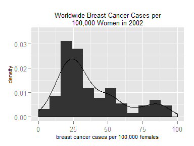
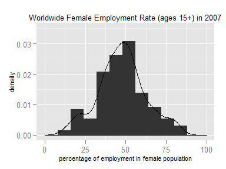
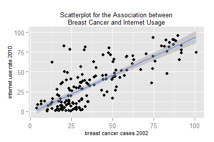
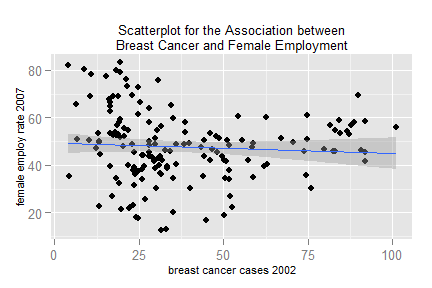
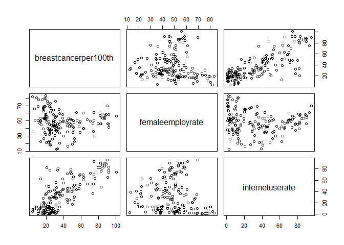
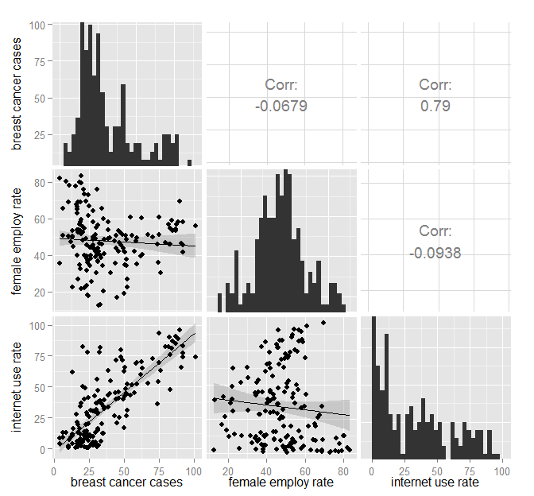
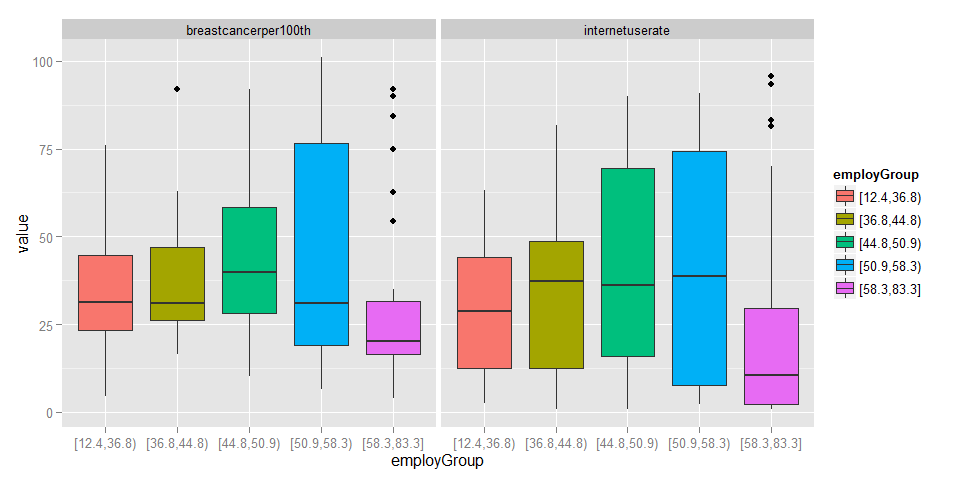

# Data Visualisation - R
Sarah Pohl  
Sunday, October 25, 2015  


This took a lot longer than planned; work has been very busy, and life as well. The [next course](https://www.coursera.org/learn/data-analysis-tools/) has started already and I'm feeling bad for not having watched a single video yet. Time to catch up (do you know where to get some?)!

As [mentioned before](http://lilithelina.tumblr.com/post/128638794919/choice-of-language), I want to compare Python and R analysis steps in the [DataManViz](http://lilithelina.tumblr.com/tagged/DataManViz) project, so this is the R version of the Data Visualisation in Python scripts ([here](http://lilithelina.tumblr.com/post/130899449414/data-visualisation-python) and [here](http://lilithelina.tumblr.com/post/131697215314/more-data-visualisation-python)). Again, the whole thing will look better over [here](http://htmlpreview.github.io/?https://github.com/LilithElina/Data-Analysis-and-Interpretation/blob/master/DataManViz/Week_Four.html).

As with the Python script, I will first run all the code from last time in one chunk: removing variables I don't need and observations for which important data is missing, and grouping the continuous variables.


```r
gapminder <- read.table("../gapminder.csv", sep = ",", header = TRUE, quote = "\"")

# subset data
sub_data <- subset(gapminder, select = c("country", "breastcancerper100th", 
    "femaleemployrate", "internetuserate"))

# remove rows with NAs
sub_data2 <- na.omit(sub_data)

# create five equal-sized groups per variable
library(Hmisc)
sub_data2["breastGroup"] <- cut2(sub_data2$breastcancerper100th, g = 5)
sub_data2["employGroup"] <- cut2(sub_data2$femaleemployrate, g = 5)
sub_data2["internGroup"] <- cut2(sub_data2$internetuserate, g = 5)
```

The topic of the last course week was data visualisation, and we were required to create univariate and multivariate plots of our variables. The univariate plots are simple histograms:


```r
library(ggplot2)
ggplot(sub_data2, aes(x = breastcancerper100th)) + geom_histogram(aes(y = ..density..), 
    binwidth = 8) + geom_density() + ylim(0, 0.035) + xlim(0, 100) + xlab("breast cancer cases per 100,000 females") + 
    ggtitle("Worldwide Breast Cancer Cases per\n100,000 Women in 2002") + theme(plot.title = element_text(size = 10), 
    axis.title.x = element_text(size = 8), axis.title.y = element_text(size = 8))

ggplot(sub_data2, aes(x = femaleemployrate)) + geom_histogram(aes(y = ..density..), 
    binwidth = 8) + geom_density() + ylim(0, 0.035) + xlim(0, 100) + xlab("percentage of employment in female population") + 
    ggtitle("Worldwide Female Employment Rate (ages 15+) in 2007") + theme(plot.title = element_text(size = 10), 
    axis.title.x = element_text(size = 8), axis.title.y = element_text(size = 8))

ggplot(sub_data2, aes(x = internetuserate)) + geom_histogram(aes(y = ..density..), 
    binwidth = 8) + geom_density() + ylim(0, 0.035) + xlim(0, 100) + xlab("percentage of internet usage") + 
    ggtitle("Worldwide Percentage of People with Access\nto the Internet in 2010") + 
    theme(plot.title = element_text(size = 10), axis.title.x = element_text(size = 8), 
        axis.title.y = element_text(size = 8))
```

   

In Python, we were introduced to the package `seaborn`, which reminded me - but only a little bit - of my favourite R plotting package, `ggplot2`. I have to admit that, right now, I prefer the basic theme of `seaborn` over the `ggplot2` grey, and I didn't have to set the font sizes manually to get an O.K. looking post (I'm not sure if this is `knitr` or `ggplot2`, or if it was `seaborn` or the `IPython Notebook`, though).

The underlying structure of the data is, of course, [still the same](http://lilithelina.tumblr.com/post/130899449414/data-visualisation-python): the new breast cancer cases per 100,000 women are right skewed with a bimodal distribution, the female employment rate seems more or less normally distributed, and the internet use rate is also right skewed, but with a rather flat peak.

Similarly, the multivariate scatterplots should still show the same relationships (or lack thereof).


```r
ggplot(sub_data2, aes(x = breastcancerper100th, y = internetuserate)) + geom_point() + 
    geom_smooth(method = lm) + xlab("breast cancer cases 2002") + ylab("internet use rate 2010") + 
    ggtitle("Scatterplot for the Association between\nBreast Cancer and Internet Usage") + 
    theme(plot.title = element_text(size = 10), axis.title.x = element_text(size = 8), 
        axis.title.y = element_text(size = 8))

ggplot(sub_data2, aes(x = breastcancerper100th, y = femaleemployrate)) + geom_point() + 
    geom_smooth(method = lm) + xlab("breast cancer cases 2002") + ylab("female employ rate 2007") + 
    ggtitle("Scatterplot for the Association between\nBreast Cancer and Female Employment") + 
    theme(plot.title = element_text(size = 10), axis.title.x = element_text(size = 8), 
        axis.title.y = element_text(size = 8))
```

  

There is a nice linear relationship between breast cancer cases in 2002 and internet usage in 2010, but nothing of the kind between breast cancer and the female employment rates of 2007. As I have already stated in the [Python post](http://lilithelina.tumblr.com/post/130899449414/data-visualisation-python), I firmly believe in "correlation is not causation", and don't actually expect that breast cancer causes internet usage. Feel free to prove me wrong.

What I also covered in [Python](http://lilithelina.tumblr.com/post/131697215314/more-data-visualisation-python) was the `pairplot()` function in `seaborn`, which created a very nice overview graph. In `R`, using `plot()` or `pairs()` is the simplest method to create something similar:


```r
plot(sub_data2[, 2:4])
# pairs(sub_data2[, 2:4])
```

 

Missing here are the histograms on the diagonal, which is a bit sad. Also sad is that there is no `ggplot2` function that would do the same thing (well, not anymore), so I have to use the package `GGally` which includes a pair plot function called `ggpairs` and uses `ggplot2` as well. Using the standard setting, the resulting plot looks like this:


```r
library(GGally)
ggpairs(data = sub_data2, columns = 2:4)
```

 

It's nice to have the density plots on the diagonal and the correlation added automatically. The layout is quite horrible in the HTML file, though. Luckily, much of it can be adjusted. For example, I can use histograms on the diagonal instead of density plots, and I can change the labels of the columns. Additionally, the easiest way to avoid the overlap of column labels with axis labels seems to be adjusting the height of the figure in `knitr`...


```r
ggpairs(data = sub_data2, columns = 2:4, upper = list(continuous = "cor", combo = "blank"), 
    lower = list(continuous = "smooth", combo = "dot"), diag = list(continuous = "bar", 
        discrete = "bar"), columnLabels = c("breast cancer cases", "female employ rate", 
        "internet use rate"))
```

 

Hm, O.K. We can see the histograms, the relationship between breast cancer cases and internet usage (with a correlation coefficient of 0.79) and the interesting scatter of points when comparing any of these two variables with the female employment rate. In the [Python script](http://lilithelina.tumblr.com/post/131697215314/more-data-visualisation-python), I explored this a bit more by categorising the female employment rate and creating boxplots. I used four groups back then, but now I'll just stick to the five I've already created (above and in a [previous post](http://lilithelina.tumblr.com/post/130558323146/data-management-r)). As before in `Python`, I have to melt my data into the right format to get two nice boxplots next to each other.


```r
library(reshape)
sub_data2.m <- melt(sub_data2, id.vars = "employGroup", measure.vars = c("breastcancerper100th", 
    "internetuserate"))
ggplot(sub_data2.m, aes(x = employGroup, y = value)) + geom_boxplot(aes(fill = employGroup)) + 
    facet_wrap(~variable)
```

 

Using five groups instead of four makes it even more apparent that countries with the highest female employment rates have the lowest breast cancer and internet usage rates. Are those the poor countries where many women have to work to provide for their families? This last group also contains the most outliers - displaying, like the scatterplots, that high female employment rates not only have low other values, but also very high ones (just nothing in the middle).

Last but not least, the pair plot using the employment groups for additional colouring:


```r
ggpairs(data = sub_data2, columns = 2:4, upper = list(continuous = "points", 
    combo = "blank"), lower = list(continuous = "points", combo = "dot"), diag = list(continuous = "density", 
    discrete = "blank"), columnLabels = c("breast cancer cases", "female employ rate", 
    "internet use rate"), colour = "employGroup")
```

 

Histograms with colours look absolutely hideous when using `ggpairs()`, so I'm using density curves again.  
The scatterplots look similar to my results in `Python`, but of course with one group/colour more. We can see how mixed the colours are in the lower left and upper right corners, but also that the two middle employment groups have their own peaks in the density plots of breast cancer cases and internet usage. The second peak for breast cancer cases that made me define this as a bimodal distribution occurs in these middle employment groups, and the internet use rate has them also at the higher end of the distribution. For lower internet use rates, the lower female employment groups seem to (almost) make up another peak.

This was all on [Data Management and Visualisation](http://lilithelina.tumblr.com/DataManViz). See you soon with the next topic - [Data Analysis Tools](https://www.coursera.org/learn/data-analysis-tools/)!
