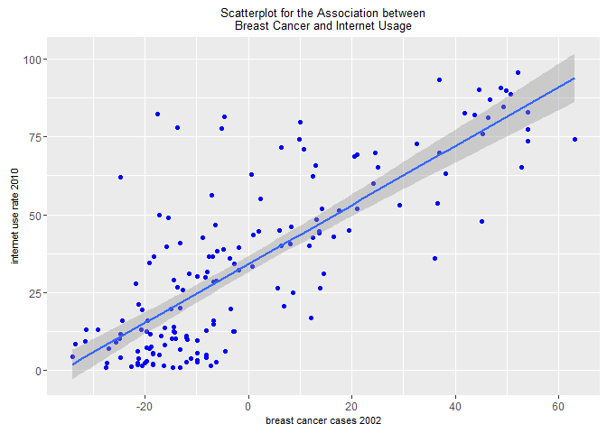
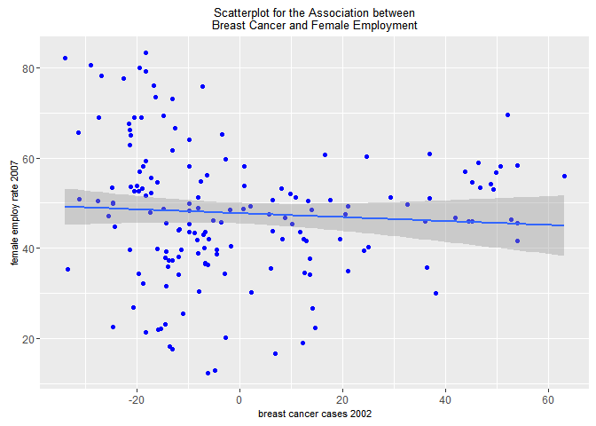

# Basic Linear Regression - R
Sarah Pohl  


As [mentioned before](http://lilithelina.tumblr.com/post/128638794919/choice-of-language), I want to compare Python and R analysis steps in the [DataManViz](http://lilithelina.tumblr.com/tagged/DataManViz), [DataAnaT](http://lilithelina.tumblr.com/tagged/DataAnaT), and now [RegModPrac](http://lilithelina.tumblr.com/RegModPrac) projects.
Therefore, this is the R version of the [Basic Linear Regression](http://lilithelina.tumblr.com/post/147441369709/regression-modelling-basic-linear-regression) Python script I posted a few days ago. Again, the whole thing will look better over [here](http://htmlpreview.github.io/?https://github.com/LilithElina/Data-Analysis-and-Interpretation/blob/master/RegModPrac/Week_Two_BasicRegression.html).

I will first run some of my previous code to remove variables I don't need and observations for which important data is missing.


```r
# load libraries
library(ggplot2)

# load data
gapminder <- read.table("../gapminder.csv", sep = ",", header = TRUE, quote = "\"")

# subset data
sub_data <- subset(gapminder, select = c("country", "breastcancerper100th", 
    "femaleemployrate", "internetuserate"))

# remove rows with NAs
sub_data2 <- na.omit(sub_data)
```

The course also required me to centre my explanatory variable, new breast cancer cases per 100,000 females in 2002. This way, the regression model will be easier to interpret. In `R`, I'm usually using `scale()` for such operations.


```r
# centre breast cancer data
sub_data2$breastCentre <- scale(sub_data2$breastcancerper100th, scale = FALSE)
summary(sub_data2)
```

```
   country          breastcancerper100th femaleemployrate internetuserate 
 Length:162         Min.   :  3.90       Min.   :12.40    Min.   : 0.720  
 Class :character   1st Qu.: 20.73       1st Qu.:38.90    1st Qu.: 9.637  
 Mode  :character   Median : 30.45       Median :47.80    Median :29.440  
                    Mean   : 37.90       Mean   :47.73    Mean   :34.082  
                    3rd Qu.: 50.38       3rd Qu.:55.88    3rd Qu.:52.769  
                    Max.   :101.10       Max.   :83.30    Max.   :95.638  
   breastCentre.V1  
 Min.   :-33.99691  
 1st Qu.:-17.17191  
 Median : -7.44691  
 Mean   :  0.00000  
 3rd Qu.: 12.47809  
 Max.   : 63.20309  
```

The mean of the original breast cancer data is 37.8969136, while the mean of the centred variable is -3.071103\times 10^{-15}, or, if rounded, 0. Nice to see that `R` has the same problems as `Python` when dealing with floats!

Scatterplots including a linear regression line visualise what I'm going to calculate:


```r
# scatterplot for breast cancer versus internet usage
ggplot(sub_data2, aes(x = breastCentre, y = internetuserate)) + geom_point(colour = "blue") + 
    geom_smooth(method = lm) + xlab("breast cancer cases 2002") + ylab("internet use rate 2010") + 
    ggtitle("Scatterplot for the Association between\nBreast Cancer and Internet Usage") + 
    theme(plot.title = element_text(size = 10), axis.title.x = element_text(size = 8), 
        axis.title.y = element_text(size = 8))
```

<!-- -->

```r
# scatterplot for breast cancer versus female employment
ggplot(sub_data2, aes(x = breastCentre, y = femaleemployrate)) + geom_point(colour = "blue") + 
    geom_smooth(method = lm) + xlab("breast cancer cases 2002") + ylab("female employ rate 2007") + 
    ggtitle("Scatterplot for the Association between\nBreast Cancer and Female Employment") + 
    theme(plot.title = element_text(size = 10), axis.title.x = element_text(size = 8), 
        axis.title.y = element_text(size = 8))
```

<!-- -->

While there seems to be a linear relationship between breast cancer and internet usage, this cannot be said for breast cancer and female employment. This relationship seems to be more complex, which I've discussed [before](http://lilithelina.tumblr.com/post/144502768654/data-analysis-moderators-r).

The linear regression function `lm()` (here not specifically for OLS) works essentially in the same way the `Python` function did: you enter the response variable, a tilde, the explanatory variable, and the name of the data set from which to take these.


```r
fit1 <- lm(internetuserate ~ breastCentre, data = sub_data2)
summary(fit1)
```

```

Call:
lm(formula = internetuserate ~ breastCentre, data = sub_data2)

Residuals:
    Min      1Q  Median      3Q     Max 
-32.260 -11.796  -1.266   8.260  65.044 

Coefficients:
             Estimate Std. Error t value Pr(>|t|)    
(Intercept)   34.0820     1.3450   25.34   <2e-16 ***
breastCentre   0.9493     0.0583   16.28   <2e-16 ***
---
Signif. codes:  0 '***' 0.001 '**' 0.01 '*' 0.05 '.' 0.1 ' ' 1

Residual standard error: 17.12 on 160 degrees of freedom
Multiple R-squared:  0.6237,	Adjusted R-squared:  0.6213 
F-statistic: 265.2 on 1 and 160 DF,  p-value: < 2.2e-16
```

The result is less structured, but also essentially the same: we get the coefficients, the $r^2$ value, the F-statistic, and a *p*-value. The actual values are identical to the results from the [Python script](http://lilithelina.tumblr.com/post/147441369709/regression-modelling-basic-linear-regression), showing that there is a strong linear association between new breast cancer cases per 100,000 in 2002 and the internet use rate from 2010. The regression formula would again be `internet usage = 34.08 + 0.95 * breast cancer`, indicating that if the breast cancer variable is increased by one, the internet use rate would be increased almost as much.


```r
fit2 <- lm(femaleemployrate ~ breastCentre, data = sub_data2)
summary(fit2)
```

```

Call:
lm(formula = femaleemployrate ~ breastCentre, data = sub_data2)

Residuals:
    Min      1Q  Median      3Q     Max 
-35.599  -9.206   0.590   8.591  34.774 

Coefficients:
             Estimate Std. Error t value Pr(>|t|)    
(Intercept)  47.73086    1.15870  41.194   <2e-16 ***
breastCentre -0.04325    0.05022  -0.861     0.39    
---
Signif. codes:  0 '***' 0.001 '**' 0.01 '*' 0.05 '.' 0.1 ' ' 1

Residual standard error: 14.75 on 160 degrees of freedom
Multiple R-squared:  0.004613,	Adjusted R-squared:  -0.001608 
F-statistic: 0.7416 on 1 and 160 DF,  p-value: 0.3905
```

The results for the association between female employment from 2007 with breast cancer are also the same as before, which means that there is no linear relationship between the two variables. This also means that `R`'s `lm()` function essentially calculates an ordinary least squares regression.
